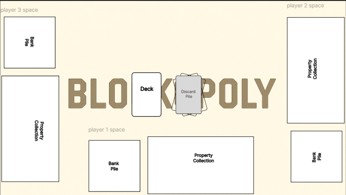
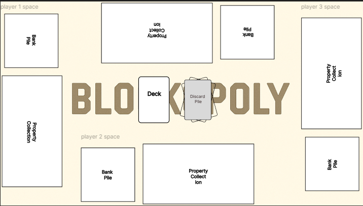
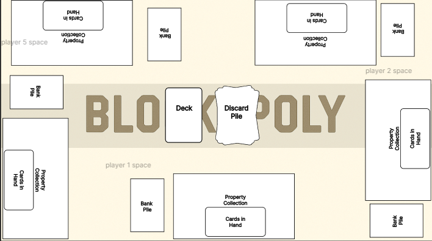

# 🧱 Blockopoly Game Board Overview

This document explains the layout and purpose of each element on the **Blockopoly Play Screen Board**.  
The board is designed to preserve a familiar Monopoly Deal–style playmat while supporting **2–5 players**, fullscreen play, and a player-centric perspective.

---

## 🎮 Board Philosophy

- The board fills the **entire screen** with no scrolling
- The **current player’s play area** is always closest to the bottom of their screen
- The board layout mirrors per client but preserves relative player positions
- Visual design stays close to the original Blockopoly playmat

---

## 🧩 Core Board Elements

### 1. Property Collection (Estate Field)

**Purpose**  
Holds all property cards owned by a player, including standard and wild properties.

Key Characteristics

- Rendered as a fixed **5 × 2 grid** of property slots
- Each slot contains a stacked group of property cards
- Supports:
  - Property color grouping
  - Set progression visibility
  - Completed set indicators
- Wild properties visually indicate their assigned color

Notes

- Property cards never enter the bank
- Property positioning locks once a rent card is played

---

### 2. Bank Pile

**Purpose**  
Stores a player’s money cards and is used to pay rent, fees, and actions.

Player Bank

- Displays a **summary view** on the board:
  - Total money value
  - Number of money cards
- Clickable to open a **bank modal**:
  - Shows all money cards
  - Supports click-based selection (future-ready for drag)

Opponent Banks

- Summary only
- Not inspectable

---

### 3. Player Hand

**Purpose**  
Holds action cards and properties not yet played.

**Key Characteristics*

- Visible only to the owning player
- Positioned near the player’s estate and bank
- Supports:
  - Card fanning
  - Hover inspection
  - Turn-based interaction

---

### 5. Discard Pile

**Purpose**  
Holds played and discarded cards.

*Visual Rules**

- Always located in the **center of the board**
- Displays the **top 3 discarded cards** in a fan spread:
  - Most recent card fully visible
  - Previous two partially visible
- Must not overlap any player fields

---

### 6. Playmat Background

**Purpose**  
Provides visual identity and grounding for the game.

*Rules**

- The Blockopoly logo and art remain visible
- Treated as a background layer
- Must not interfere with gameplay readability

---

## 👥 Player Spaces

Each player has a dedicated **player space** containing:

- Property Collection
- Bank
- Hand

### Player-Centric View Logic

- Each client sees **their own player space closest to the bottom**
- Other players are positioned relative to that perspective
- Orientation mirrors automatically per client

---

## 🖼 Board Layout Examples by Player Count

Use the sections below to document and visualize how the board adapts as player count increases.

### 🔹 2-Player Board Layout

Description

- Current player at bottom
- Opponent directly across

### 3-Player Board Layout

Description

Current player at bottom

Two opponents distributed across left and right

### 4-Player Board Layout

Description

Current player at bottom

Opponents distributed evenly on left, top, and right

### 5-Player Board Layout

Description

Current player at bottom

Opponents arranged linearly on sides with minimal compression

Board remains readable and uncluttered

Image

